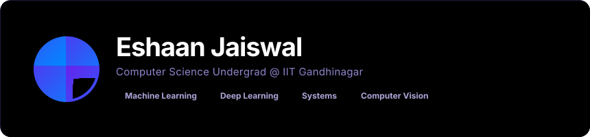

## About

* 2nd Year undergraduate in Computer Science and Engineering at IIT Gandhinagar.
* Interests: Computer Vision, Deep Learning, Machine Learning, Computer Architecture, Systems, and Algorithmic Research.
* I focus on strong theory backed by practical experimentation.

## Research

* Working under Prof. Shanmuganathan at the CVIG Lab, IIT Gandhinagar.
* Focus: Motion Dynamics in Generative Models for motion and visual synthesis.

## Experience

* Delivery Data Scientist Intern, Turing (May 2025 - July 2025).

## Skills

* Languages: C, C++, Python, SQL, HTML, CSS, JavaScript, Verilog.
* Core Interests: Computer Vision, Deep Learning, Machine Learning, Computer Architecture, Systems, Competitive Programming, Web Development.
* Foundations: Data Structures and Algorithms.

***

